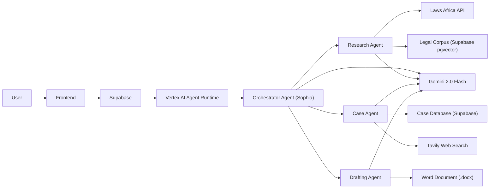

```mermaid
flowchart LR
    User --> Frontend
    Frontend --> Supabase

    Supabase --> VertexAI["Vertex AI Agent Runtime"]

    VertexAI --> Orchestrator["Orchestrator Agent (Sophia)"]

    Orchestrator --> ResearchAgent["Research Agent"]
    Orchestrator --> CaseAgent["Case Agent"]
    Orchestrator --> DraftingAgent["Drafting Agent"]

    ResearchAgent --> LawsAfrica["Laws Africa API"]
    ResearchAgent --> Corpus["Legal Corpus (Supabase pgvector)"]

    CaseAgent --> CaseDB["Case Database (Supabase)"]
    CaseAgent --> Tavily["Tavily Web Search"]

    DraftingAgent --> DocX["Word Document (.docx)"]

    Orchestrator --> Gemini["Gemini 2.0 Flash"]
    ResearchAgent --> Gemini
    CaseAgent --> Gemini
    DraftingAgent --> Gemini
```
